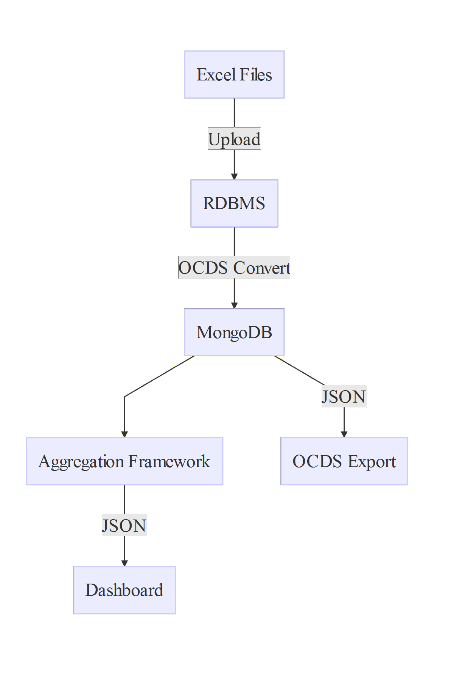

# Open Contracting Vietnam (OCVN)

[](https://travis-ci.org/devgateway/ocvn)

## Presentation

OCVN is a project that allows importing the Vietnam public procurement data, available in the common MS Excel format, into a native [Open Contracting Data Standard (OCDS)](http://standard.open-contracting.org/) NoSQL storage, and then run visual data analytics (display a *live* dashboard with charts, maps and data tables as well as custom comparison charts). Since the data is natively stored in the OCDS format, it can be readily exported in this format without any transformation required, and with great throughput.

Find out more about the OCVN goals [here](http://www.developmentgateway.org/2015/11/12/open-contracting-vietnam/).

## Visual Identity
SVG and raster version of the logo and favicon can be found in the [`docs/images`](./docs/images/) directory.

### Logo:


### Favicon:


# Modules

The project uses open source technologies exclusively, with the following list of key components:

- [Spring Framework](https://projects.spring.io/spring-framework/) - for security, service oriented architecture and REST API.
- [JPA persistence](http://hibernate.org/orm/) for temporarily storing and organizing the MS Excel Files containing the raw data.
- [Apache POI](https://poi.apache.org/) for reading the native MS Excel input dataset.
- [MongoDB](https://www.mongodb.org/) - as the native OCDS NoSQL datastore. We have implemented the whole OCDS 1.0 standard schema and all data used in analytics/maps as well as raw OCDS export is stored directly into this format in MongoDB.
- [Apache Wicket](http://wicket.apache.org/) - for the admin interface that runs the upload/import process of raw data
- [React](https://facebook.github.io/react/) - for integrating the dashboard/map/filter technologies
- [Plot.ly](https://plot.ly/) - as the chart library
- [Leaflet](http://leafletjs.com/) - as the map library

The project's source code is licensed under the open source [MIT](https://opensource.org/licenses/MIT) license.

## Architecture

This is a mavenized multi-module project. It is built on the open source [dg-toolkit](https://github.com/devgateway/dg-toolkit) architecture. Each module can be started independently of the rest. All modules are based on [Spring Boot](http://projects.spring.io/spring-boot/) templates.



The project uses [the gitflow workflow](https://github.com/devgateway/ocvn/blob/develop/gitflow.md) to drive the software release process.

### Modules

- [persistence](https://github.com/devgateway/ocvn/tree/master/persistence) - this is a module responsible with [JPA 2.0](https://en.wikipedia.org/wiki/Java_Persistence_API) data persistence. It is also provides [HATEOAS](https://en.wikipedia.org/wiki/HATEOAS) services on top of the existing entities.

- [persistence-mongodb](https://github.com/devgateway/ocvn/tree/master/persistence-mongodb) - this is a module responsible with Spring Data MongoDB access. It stores the MongoDB DAO and MongoDB Template configuration files.

- [web](https://github.com/devgateway/ocvn/tree/master/web) - this module provides REST endpoints for the services needed, as well as basic security. It depends on the **persistence** module.

- [forms](https://github.com/devgateway/ocvn/tree/master/forms) - this module provides a basic toolkit for quickly building forms over the entities defined in the persistence module. It uses [Apache Wicket](http://wicket.apache.org/) as the backend.

- [ui](https://github.com/devgateway/ocvn/tree/master/ui) - this module is a template for building front-end functionality. It is supposed to work in conjunction with the **web** module as the back-end. It is based on [React](https://facebook.github.io/react/) and [NuclearJS](https://optimizely.github.io/nuclear-js/). The Maven build integration is assured by [frontend-maven-plugin](https://github.com/eirslett/frontend-maven-plugin) which invokes [npm](https://www.npmjs.com/) and [webpack](https://webpack.github.io/). The UI module can be used by both UI developers, with no need of knowledge or Java/Maven local setup and by the back-end developers, with no need to have [node](https://nodejs.org/) installed on their system.

### Building

As prerequisites, we need Java 8 and Maven 3.3.x.
In order to build the project, invoke:

```
mvn install
```

isnide the root project folder.

### Debugging

You can import dg-toolkit as a Maven project inside your favorite IDE, it should work in IDEA/STS/Eclipse but you will need Maven 3.3.x.

## Debugging in STS

Since all the modules are Spring Boot, debugging in STS is really easy. In Spring Boot 1.3 and later there is something called [spring-boot-devtools](https://spring.io/blog/2015/06/17/devtools-in-spring-boot-1-3).
This dependency is already included in the pom.xml of the modules, uncomment it if you plan to use it. If you do, then in STS you can do Debug As->Spring DevTools Client.

If you have JRebel license, then don't use spring-boot-devtools. Best is to start the modules by invoking Debug As->Spring Boot App

### Debugging fat jars

[Fat jars](http://docs.spring.io/spring-boot/docs/current/reference/html/howto-build.html) are the way to go when it comes to java micro-services these days. While the pre-built maven project can be easily debugged as described above, a already packaged jar requires remote debugging. You can start the fat jar with remote debugging parameters by invoking:

`java -Xverify:none -noverify -Xdebug -Xrunjdwp:transport=dt_socket,server=y,suspend=n,address=5005 -jar fat.jar`

... And then for example in STS you can add a new Debug Configuration->Remote Java Application and specify localhost and port 5005.
## Running dg-toolkit

DG-toolkit is a package of several modules, among which forms and web are runnable. See the [forms](https://github.com/devgateway/dg-toolkit/tree/master/forms) and/or the [web](https://github.com/devgateway/dg-toolkit/tree/master/web) modules documentation for starting the project.

## Installing dg-toolkit as system service on the production server

We are closely following the spring boot executable/fat jar documentation which provides an extremely nice way to run a jar as a linux system service. This works for both the old System V and the new systemd. You can find [the full Spring documentation here] (http://docs.spring.io/spring-boot/docs/current/reference/htmlsingle/#deployment-service).


## Start a new project with DG-Toolkit as the base

DG-Toolkit should be used as a template project, so as starting point for other projects. This should be done by forking the repository. Unfortunately Github denies forking of repositories inside the same organization, so @devgateway can own only one DG-Toolkit fork (the current one). A chat with Github support has not solved the problem, they used to have this functionality but have opted to disable it. Therefore one cannot use the FORK button on Github, but since Git is the back-end of Github, this does not mean you cannot fork it using git on your machine.

To fork DG-Toolkit you can simply create a new independent github repository, and after creation add a new remote on your machine. So you will have /origin/ that points to the new repo, and say dg-toolkit remote that points to the DG-Toolkit repo url. After this you should be able to merge from dg-toolkit remote to the origin remote, that is, you can take DG-Toolkit code and merge it over your existing empty project, thus you will get the DG-Toolkit tree inside your local project. This is much better than just copy-pasting the contents of DG-Toolkit. If you use remotes, you can later merge new fixes and features from DG-Toolkit back into your project, thus you keep your project up to date with fixes coming from DG-Toolkit.

## Contributing code back to DG-Toolkit

There are several ways in which this can be achieved:

### Forking DG-Tookit for a feature/fix development

The best and easiest is to fork DG-Toolkit for the sole purpose of developing a new module/feature/fix. You can very well use your own private github user space to do this and thus you can use the FORK button on the Ghihub page. After the fork you can commit all your new stuff to your copy of DG-Tooolkit then ask for a Pull Request of your code back into DG-Toolkit.

### Develop the contributions in an already forked project

Yes, it would be cool if we could develop the new contribution as part of your current project, which was forked some time ago from DG-Toolkit. It is possible but it is a bit trickier. You will not be able to merge your project back to DG-Toolkit, because this will bring all your project's custom code into DG-Toolkit, so basically the customized implementation the client has asked for, like all the dashboards and forms that it asked. That is undesirable.

One simple solution to this is to commit the changes you are willing to merge back to DG-Toolkit as atomic changes. That means that when you commit your files, you commit only those files that are related to that new feature and nothing else. For example let's suppose you want to develop a new search module that will use Lucene for indexing and you will like to merge this new module to DG-Toolkit. You should commit all the code that has to do with the search module in separate commits that do not contain other code, for example if the search module is also used in a dashboard page in your project, you will commit that linking in a separate commit , so keep the commits that target the module functionality separate.

Then, you can cherry-pick your project's branch over the dg-tookit remote branch. By doing so, you can pick what commits to apply and what to leave out and you will choose only the commits that implement the generic new module functionality and you will leave out the client-specific customizations that are not meant to be posted to DG-Toolkit

## Thanks!


OCVN uses YourKit Java Profiler for Performance Tuning.

YourKit supports open source projects with its full-featured Java Profiler.
YourKit, LLC is the creator of <a href="https://www.yourkit.com/java/profiler/index.jsp">YourKit Java Profiler</a>
and <a href="https://www.yourkit.com/.net/profiler/index.jsp">YourKit .NET Profiler</a>,
innovative and intelligent tools for profiling Java and .NET applications.
